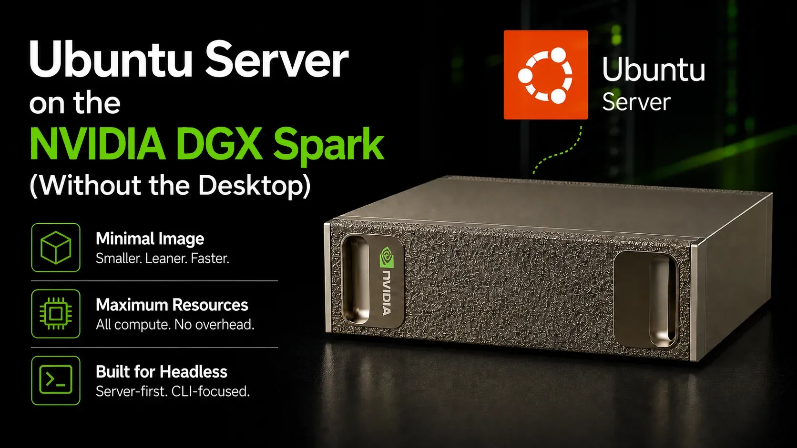

# Ubuntu 24.04 + NVIDIA Stack Setup for GB10 / DGX Spark Systems

[](https://technotim.com/posts/ubuntu-gb10/)

This repo documents the full setup of an **NVIDIA GB10 Grace Blackwell** system as a clean
Ubuntu 24.04 GPU server, modeled after DGX OS 7 but running standard Ubuntu Server without
NVIDIA's customized DGX OS image.

Read the full write-up: [Ubuntu Server on the NVIDIA DGX Spark (Without the Desktop)](https://technotim.com/posts/ubuntu-gb10/)

This guide applies to the **NVIDIA DGX Spark** and all GB10-based partner systems, including:

- ASUS Ascent GX10 *(used to write this guide)*
- NVIDIA DGX Spark
- Lenovo ThinkStation GB10
- Dell GB10-based workstations
- HP, MSI, Gigabyte, and other GB10 OEM units

The GB10 is an **ARM64** platform. All packages, ISOs, and repo URLs must use the **arm64** variant.

## Hardware

All GB10 systems share the same **NVIDIA GB10 Grace Blackwell Superchip** SoC:

- NVIDIA Blackwell GPU with 5th-gen Tensor Cores and FP4 (1 petaFLOP AI)
- 128 GB unified LPDDR5x memory shared between the 20-core ARM Grace CPU and GPU via NVLink-C2C
- NVIDIA ConnectX-7 NIC (two GX10 units can be linked)
- 10 GbE LAN

> All GB10 partner systems share the same ARM64 SoC. This is NOT x86_64.

## References

- [DGX OS 7 User Guide - Customizing Ubuntu with DGX Software](https://docs.nvidia.com/dgx/dgx-os-7-user-guide/installing_on_ubuntu.html)
- [NVIDIA DGX Spark Product Page](https://www.nvidia.com/en-us/products/workstations/dgx-spark/)
- [ASUS Ascent GX10 Product Page](https://www.asus.com/networking-iot-servers/desktop-ai-supercomputer/ultra-small-ai-supercomputers/asus-ascent-gx10/)
- [Ubuntu Server 24.04 LTS](https://ubuntu.com/server)

## Host Info

Example values used in this guide (replace with your own):

| Key       | Value                           |
|-----------|----------------------------------|
| Hostname  | gb10-1.local                    |
| OS Target | Ubuntu Server 24.04 LTS         |
| Arch      | **arm64** (Grace Blackwell)     |
| GPU       | NVIDIA Blackwell (GB10)         |
| Memory    | 128 GB unified (CPU+GPU shared) |
| NIC       | NVIDIA ConnectX-7 + 10 GbE      |

## Current Target Software Versions

Based on the DGX Spark / DGX OS 7.5.0 release (June 2026). GB10 partner systems
may trail the DGX Spark Founders Edition by a release or two.

| Component           | Version        | Notes                                      |
|---------------------|----------------|--------------------------------------------|
| DGX OS              | 7.5.0          | Reference baseline (Founders Edition)      |
| NVIDIA GPU Driver   | 580.167.08     | Open kernel modules, required for Blackwell|
| NVIDIA CUDA Toolkit | 13.0.2         |                                            |
| Canonical Kernel    | 6.17 (HWE)     | `linux-nvidia-hwe-24.04`                   |
| Ubuntu Base         | 24.04 LTS      | arm64                                      |

> **Unified Memory Note:** The GB10 has no dedicated VRAM. The GPU and CPU share
> 128 GB of system DRAM via NVLink-C2C. `nvidia-smi` will report
> `Memory-Usage: Not Supported` - this is expected and normal on iGPU/UMA systems.

## Guide Sections

| File                                                   | Description                               |
|--------------------------------------------------------|-------------------------------------------|
| [docs/01-ubuntu-install.md](docs/01-ubuntu-install.md) | Ubuntu Server 24.04 (arm64) install       |
| [docs/02-nvidia-stack.md](docs/02-nvidia-stack.md)     | NVIDIA GPU driver + CUDA + HWE kernel     |
| [docs/03-docker-gpu.md](docs/03-docker-gpu.md)         | Docker CE + NVIDIA Container Toolkit      |
| [docs/04-doca-ofed.md](docs/04-doca-ofed.md)           | ConnectX-7 NIC + DOCA-OFED drivers        |
| [docs/05-verify.md](docs/05-verify.md)                 | Post-install verification steps           |
| [docs/06-optimizations.md](docs/06-optimizations.md)   | Post-install performance tuning           |
| [docs/07-dual-node.md](docs/07-dual-node.md)           | Dual-node NCCL + CX-7 interconnect setup  |

## Quick-Start Order

1. Install Ubuntu Server 24.04 (arm64) - see [docs/01-ubuntu-install.md](docs/01-ubuntu-install.md)
2. Add NVIDIA repos, HWE kernel, GPU driver, CUDA - see [docs/02-nvidia-stack.md](docs/02-nvidia-stack.md)
3. Install Docker + NVIDIA Container Toolkit - see [docs/03-docker-gpu.md](docs/03-docker-gpu.md)
4. (Optional) ConnectX-7 DOCA-OFED drivers - see [docs/04-doca-ofed.md](docs/04-doca-ofed.md)
5. Verify everything works - see [docs/05-verify.md](docs/05-verify.md)
6. (Optional) Performance tuning - see [docs/06-optimizations.md](docs/06-optimizations.md)
7. (Optional) Dual-node NCCL setup - see [docs/07-dual-node.md](docs/07-dual-node.md)

## Ansible Automation

The `playbooks/` directory contains Ansible roles that automate steps 2-5 above.
The Ubuntu install (step 1) and the Secure Boot MOK console enrollment must be done manually.

### Prerequisites

- Ubuntu 24.04 installed and reachable via SSH
- An `automation` user with passwordless sudo and your SSH key deployed
  (run `bootstrap.yml` once if the account does not exist yet)
- Ansible installed on your control machine (`pip install ansible`)

### First-time bootstrap (if automation user does not exist)

```bash
cd playbooks
ansible-playbook bootstrap.yml -i <ip>, -u <install-user> --ask-pass --ask-become-pass
```

### Full setup

> **Security note:** `mok_password` is a one-time throwaway password - pick
> something simple you can type at the UEFI console on the next reboot. To keep
> it out of your shell history, prefix the command with a leading space (requires
> `HISTCONTROL=ignorespace` in bash, or `setopt HIST_IGNORE_SPACE` in zsh), or
> pass it via a temp file: `echo 'mok_password: yourpassword' > /tmp/mok.yml &&
> ansible-playbook ... -e @/tmp/mok.yml && rm /tmp/mok.yml`.

```bash
cd playbooks
ansible-playbook site.yml -i <ip>, -e target=all -e 'mok_password=<one-time-password>'
```

After the playbook completes, **reboot and watch the console** for the blue
"Perform MOK management" screen. Enroll the MOK key using the password you set above.
This is a one-time step required for Secure Boot systems.

### Verify

```bash
ansible-playbook verify.yml -i <ip>, -e target=all
```

Runs 33 checks across OS, kernel, Secure Boot, NVIDIA driver, services, CUDA, Docker, and system hygiene. All checks are read-only.
